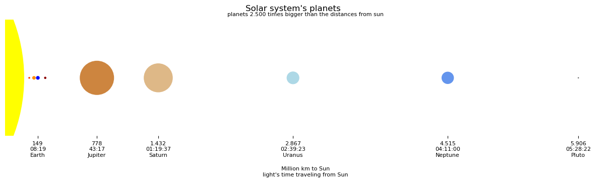

# Solar System 
This directory deals with information, diagram, data about our solar system.

## Motivation
The pure number regarding our solar system's objects rarley give us an idea about is sizing, and what that sizes imply.
Just the distances are so big, that it becomes difficult to draw them with proper scaling.
You can not have the same scale for the objects'
- distances from sun to planet - with its Million km, e.g. it goes better just to focus the inner or the outer planets
    - Mercury: 58 Mio km
    - Pluto: 5.906 Mio km. Pluto is more than 100 times farther from Sun than Mercury.
- sizes: planets' diameters 
    - Mercury:   4.879 km
    - Jupiter: 142.984 km. The diameter of Mercury fits about 30 times into the diameter of Jupiter.

Distances and planets' diameters are scalled different. The diagramm shows the planets' diameter 2.500 times bigger than the distances from sun. That means they should be 2.500 times smaller than actually drawn, but if so - you will get for all of them just a point, unable to compare the planets' sizing.
  
The distances, with its Million km, we will match with the speed of light 
-   299.792 km / sec, equivalent to
-   0,299 Mio km / sec

So we find the light needs more than eight minutes to reach the Earth, and more the four hours traveling to Neptune.

Assuming the Sun will turn off, we (at Earth) will realize it after more than eight minutes.

## Technology used
The coding has been done with a `jupyter-lab notebook` running at an older (2019) laptop as our server, accessible from remote throuh our intranet LAN
- Acer Aspire E5-575G, with
    - Intel(R) Core(TM) i5-7200U CPU @ 2.50GHz, 
    -  4 core, 
    - 32 GB RAM, 
    - NVNe SSD 1 TB,  
    - OS: `Manjaro`, 
    
using `Python` with `pandas`, `numpy` and `matplotlib`

## Data used

Originally our `Jupyter notebook` acesses the data via `pandas` and the `mysql.connector` from a `mariadb` - testing the `jupyter-lab` instead of the `jupyter notebook`, and kernels for `octave`, `gnuplot` and `mariadb`, this projekt was a proof of concept of the server's setup - and it works within our LAN. 

You can take the csv file and use <a href="https://pandas.pydata.org/docs/reference/api/pandas.read_csv.html">pandas.read_csv</a> to work with the data - as done here.

|object | diameter__km | distance_from_sun__Mio_km | matplotlib_color |
|-------|--------------|---------------------------|------------------|
| Mercury | 4_879| 57.90 | orangered |
| Venus | 12_104 | 108.20 | darkorange |
| Earth | 12_756 | 149.60 | blue |
| Moon | 3_475 | 0.38 | brown |
| Mars | 6_792 | 228.00 | darkred |
| Jupiter | 142_984 | 778.50 | peru |
| Saturn | 120_536 | 1_432.00 | burlywood |
| Uranus | 51_118 | 2_867.00 | lightblue |
| Neptune | 49_528 | 4_515.00 | cornflowerblue |
| Pluto | 2_376 | 5_906.40 | dimgray |
| Sun | 1392700 | 0.00 | yellow |

> **Note:** see file `solar_system.csv`, use **;** as separator

## Code
is a pure `jupyter-lab notebook` importing some `python` libraries (`pandas`, `numpy`, `datetime`, `matplotlib`) and a collection of 3 helper funtion from `solar_system_helpers.py` (in the same directory as the notebook).

``` python 
    def get_data_from_csv(fn : str, 
                          df : pd.DataFrame) 
        -> pd.DataFrame
    
    def gen_planets_as_circles(df: pd.DataFrame) 
        -> (np.array, np.array)
    
    def gen_diagram(fig: plt.figure, 
                    ax: plt.axes, 
                    vals: np.array, 
                    df: pd.DataFrame) 
        -> plt.figure
```

## Result
We produce a small diagram of the solar system's planets, see the notebook.
<!--
<a href="solar_system.png" target="_blank">
<figure>
    
</figure>
</a>
-->
<!--    <figcaption>Solar System's planets</figcaption> -->

